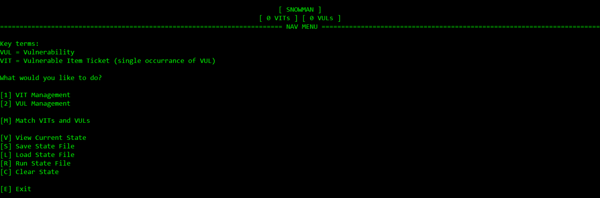
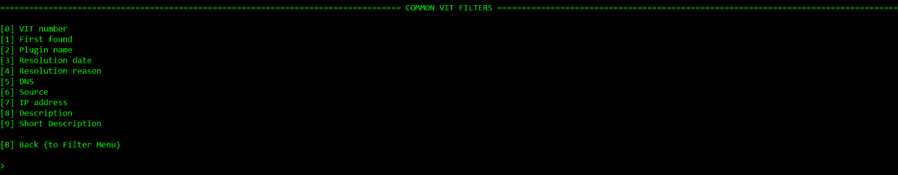
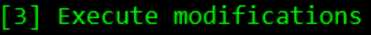
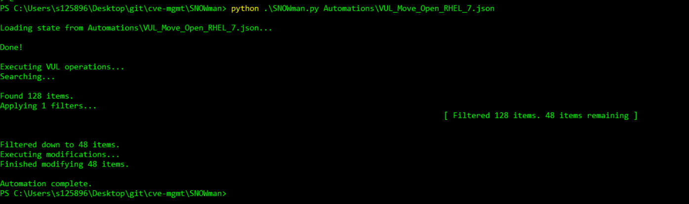
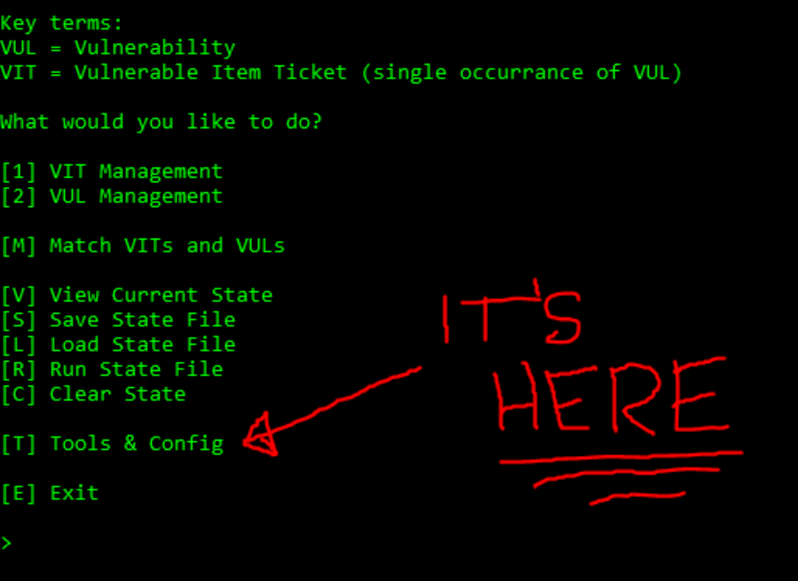

# snowman-snow-manager
Vulnerability ticket manager for ServiceNow. CLI and automation.

# What is Snowman? ⛄

Snowman is a Service Now Vulnerability Ticket Manager.
It allows you to do almost anything to bulk modify Service Now VULs and VITs. 

**VITs**
A "VIT" is a specific occurrence of a vulnerability on a machine. On the backend, Service Now calls them Vulnerable ITems, hence the VIT name. Each VIT is generally paired to a VUL, though sometimes they can be on their own (making them annoying to deal with). A VIT tells you "This specific computer can get hacked because it has x vulnerability".

**VULs**
A "VUL" is a vulnerability within the Service Now system. It is something that could potentially get hacked, but not a specific occurrence. Each VUL generally has multiple associated VITs, so you can think of a VUL as a folder full of similar Vulnerable Items (VITs). A VUL tells you "These computers can get hacked because they have x vulnerability".

# Why might you need Snowman? 🥶
Service Now vulnerabilities are usually generated automatically by plugins such as Tenable. Tenable scans machines for known vulnerabilities, and creates new VITs for each machine. This can become an issue for teams which manage lots of environments, as you can end up with 200+ VITs for one VUL. 

As the number of machines you manage increases, your ability to manage these vulnerabilities diminishes. 
Tenable also sometimes assigns vulnerabilities to the wrong teams, meaning your queue can be full of vulnerabilities you can't even remediate.
This is where Snowman comes in. 

# Installing and Running Snowman 💻
**PYTHON 3.10 OR ABOVE REQUIRED**

Clone *this GitHub repo*.

Navigate to the directory you cloned into.

Run the snowman.py file with Python by executing python snowman.py.

On first execution, Snowman will check for required dependencies, and install them where necessary. 

Pictured: me deleting every dependency and then running snowman.py. Snowman then grabs the required dependencies in the requirements.txt file, and exits when it's finished. 
You should then be able to run python snowman.py again and it should launch into the CLI.

# How do you use Snowman? 🤷‍♀️
Snowman generally follows a fairly simple user flow. 

First, choose whether you want to use the VIT or VUL manager. This will depend on whether you want to do operations on a more granular level, separating individual VITs, or on the VUL level.

## Search > Filter > Modify

### Search 🔍

Create a collection of key : value pairs to search VITs or VULs by. 
Searches are done for EXACT MATCHES (as of v1.2.1). If you need to do a CONTAINS filter, you must first complete your search with all exact matches, then filter from the Filter Menu.

The [0] Add common VIT/VUL search criteria  option brings up a menu with commonly searched keys, as well as providing some UX optimisations such as automatically converting group names to their system IDs (sys_id) for searches.

[V] View current VITs/VULs prints out any items you've currently got in your VIT/VUL Manager. It prints these as a digest, displaying some important values, but it does not display EVERY value, as the API response contains hundreds of values. As of v1.2.0 you can modify the digests Snowman prints in the Tools and Config menu.

If you want to see more values (as of v1.0.5), the only way to do this is to use [8] Save current VITs/VULs to txt file, and save them with option [2] Raw response, which outputs the ENTIRE API RESPONSE to the txt file.

Note: I'm saving the raw output for 2,269 VITs here, which is far more than you'd usually do.

(Yes, the raw output of 2,269 VITs made Notepad crash, but that's not my fault, is it? @Bill Gates pls fix)

### Filter 💡

We have 2,269 VITs loaded right now. Let's try to filter that down. 

Let's see what we have in the common filters menu...

Ok, let's apply an IP address filter to get VITs affecting machines in the 172 IP range...

Applying that filter, we see there are now only 81 VITs remaining! Much more manageable. 

### Modify 💣

The modification menu works much like the Search and Filter menus, though there are some restrictions this time. 

Like the previous menus, you select keys and enter values, but this time we are queuing modifications which will be applied to those values.

Let's try `[0] Add common modification`.

Ok, let's add a work note to the 80 VITs we have loaded. We'll select [3] and write our work note...

Now, let's execute this mod.

Ok, let's check out one of those 80 VITs to see if the mod applied successfully...

There it is!

Even though this demo was just one modification, you can add as many modifications as you want to change assignment groups, close tickets, comment, change individual assignees, etc.

# Automations 🦾

This is where Snowman really starts to shine. 

Once you've worked out what Search Criteria, Filters, and Modifications you want to use to handle whatever you're trying to handle, you can save those to a State file. 

State files are just a JSON representation of a specific Snowman state, saving everything except the current search results (as these will change every time you do a search). 

When you have a State file, you can use that file as an INPUT to Snowman, telling it which Search Criteria, Filters, and Modifications to run. Snowman will then step through each part of that process, automating what you previously had to do by hand. 

You can run State files from the Nav Menu with `[R] Run State File`, or you can input the state file as a command line argument when you run Snowman to skip the UI altogether. This is extremely powerful for automations, as you can create cronjobs or bamboo jobs that run every hour/day/week/month to achieve whatever you need! 

Option to run state file from within CLI.

Running a state file as a command line argument (facilitating greater automation).

Note that automations can handle VITs and VULs in the same state file, though this demo file specifically only contains VUL actions. 

### Inputting Multiple Automation Files 🔢
As of v1.3.0, Snowman is capable of ingesting multiple state.json files simultaneously, which it will then execute iteratively. 

`python snowman.py state1.json state2.json state3.json state4.json state5.json state6.json state7.json state8.json state9.json state10.json YouGetTheIdea.json`

### Automation with GitHub Actions 🧪
1. Create a branch of Snowman
2. Create automation .json files (if you haven't already), and store them in the automations/ directory. 
    - Recommend you create and test them locally, in the dev environment. When you commit your changes DON'T commit your config file as it is shared between all GitHub Actions jobs. If you need a different config file you will have to create your own Snowman branch with that config.
3. Duplicate the TEMPLATE_ACTION.yml in the .github/workflows directory. Name the dupe whatever you want (preferably something to do with you/your team/what you want to accomplish with your automation).
4. Set schedule for GitHub Action in the .yml file (GitHub runs on UTC time).
5. Remove line 21 (which prevents the template action from running)
6. Add your automation file/s on line 40.
7. Commit your changes.

Note: When using cron schedules for GitHub Actions it can take a while for GitHub to recognise your schedule. Make sure your schedule is for at least 10 minutes in the future if you want to test it, or test it running on git push. It may also take some time to kick off due to GitHub Runners availability.

That's it! 

Have fun automationing!

# Tools & Config 🔧

The Tools & Config menu let's the user modify how Snowman functions. It's a bit intimidating but it has some fun ASCII art to make it less scary. 

Originally you had to exit to save config changes, like an old PC game, but from v1.2.5 Snowman can live reload the modules affected by config changes, meaning you don't need to exit to apply changes. 

The menu explains what each option does pretty well. so I won't rehash it. Some of these options are more for development purposes, like the debug mode and advanced logging, but I hope some of them will be useful to users too. 

# Techy Stuff 🤖

## UML Diagram of Snowman 👩‍💻

Just kidding, here's the *real* UML:

*(UML accurate as of 19/07/2023)*

## A High Level Overview ⚡

The main file is `snowman.py`. It contains code to initialise the VIT and VUL managers.

It also has code to perform actions across both managers, such as viewing the states of both, or clearing both states.

When you run this file with python snowman.py, the first thing it does is initialise a new SnowmanState object, which in turn initialises the vit_state and vul_state objects.

The vit_state  and vul_state  objects are from the vit_management.py and vul_management.py files. 

Both of these classes inherit from the `ParentState()` class, in the `parent_state.py` file. 

The ParentState(ABC) class defines 5 variables (as of v1.2.1). 2 dictionaries and 4 lists. 

Everything you do in Snowman boils down to manipulating these 5 objects.

• `self.criteria` stores `key : value` pairs, which are used to craft a SNOW API GET request.
• `self.contains_filters` stores `key : value` pairs for filtering results (searching for substrings in a key value).
• `self.does_not_contain_filters`  also stores `key : value` pairs for filtering results (searching for substrings NOT in a key value).
• `self.mods`  stores `key : value` pairs which are used to craft a SNOW API PUT request, changing values in VITs/VULs.
• `self.results` stores search results as a list of VITs or VULs.

Snowman has a variety of menus for the user to manipulate these objects. 

# FAQ 🔭

### Why can't I set a limit greater than 4000?
The Service Now API times out after roughly 4000 results, in my testing I found 5000 results times out every time, but 4000 is a safe limit.

#### Workarounds: 
• Run multiple times. You can input the same JSON automation file multiple times as runtime arguments so you don't have to sit around waiting for it to execute. `python3 snowman.py file.json file.json file.json`
• Get VULs first, then match them to their VITs. This splits up the API call into multiple smaller calls, BUT it takes ages (roughly 1 hour for 5000 VITs), and CANNOT BE DONE as an automation.
• Change the config YAML directly to set a greater limit. Don't be surprised if it times out.

### Why do I keep getting error 403s when assigning VITs to a new VUL?
Only a fool would pretend to understand the inner machinations of the Service Now API.  (I think it's probably because those VITs are already in the VUL you're assigning them to)

# Tips & Tricks ✨
• Want to see what changes you've made with Snowman? Check the LOGman.log file!
• Want to see changes OTHERS have made using Snowman? Use the search criteria `sys_updated_by : YOUR_API_ACCOUNT_NAME`

# Roadmap 🗺

Some things coming in future versions of Snowman (no guarantees these all happen though)

• Open source so others can use/develop Snowman ✅
• Config file can be updated without exiting Snowman ✅
• Ability to load multiple State Files for larger automations ✅
• Group items into VUL ✅
    ◦ Handling to prevent SNOW from modifying the VUL (copy VUL values, do VIT move, modify VUL to original values) ✅
• Animated splashcreen ASCII (lol)
• VIT reassignment optimisations (building list of unique VULs to pull from to avoid some API calls)
• Assignment group converted to name in digest (with optimisation to build match list instead of calling API every time)

# Troubleshooting 💥

• Make sure you are on the latest version of Python. This script has only been tested with Python 3.12, your mileage may vary with earlier Python releases. 
    ◦ DOES NOT WORK with Python versions less than 3.10.0
• If you're having issues with certain operations, try enabling Debug Mode – This may give you additional information when an operation fails.
• As of v1.0.0 Snowman is compatible with Windows, macOS and Linux. It has been tested with Windows 10, macOS Ventura 13.4.1, macOS Sonoma 14.2.1, and Fedora Linux 39.
